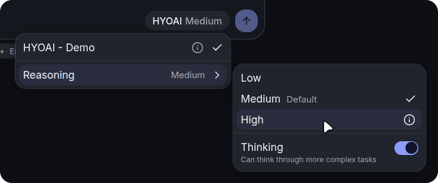
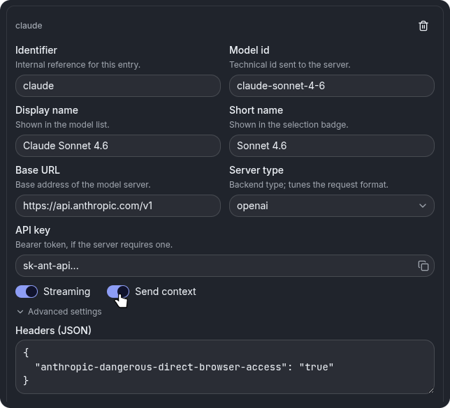
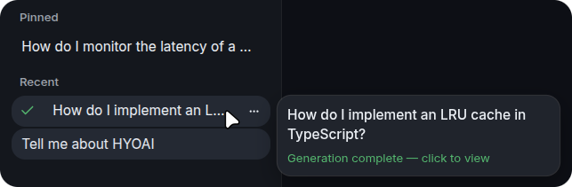
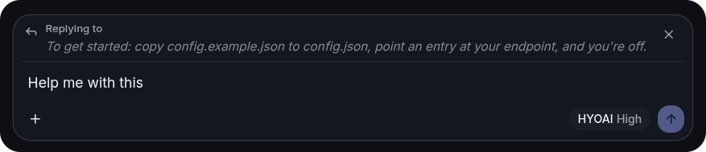
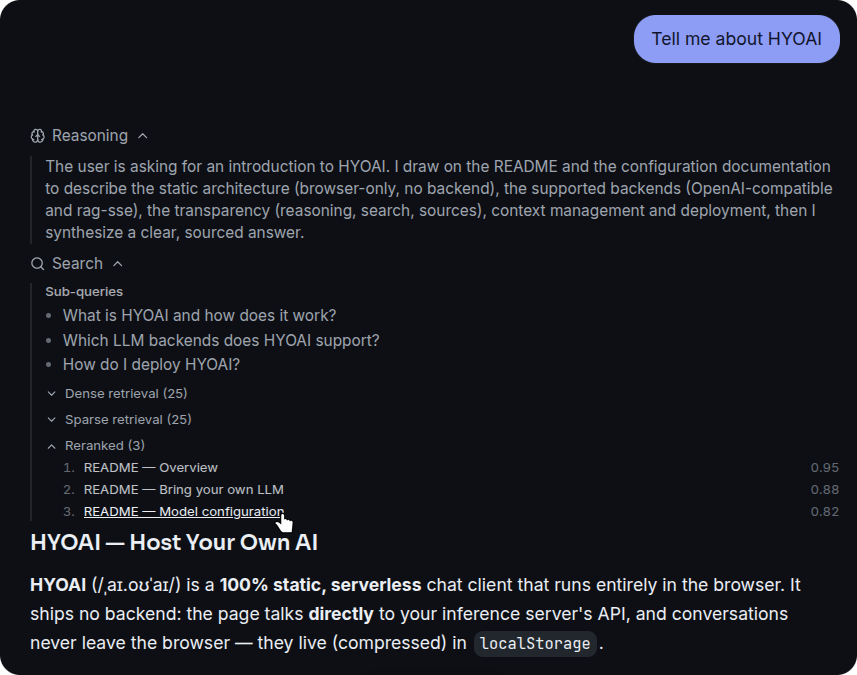
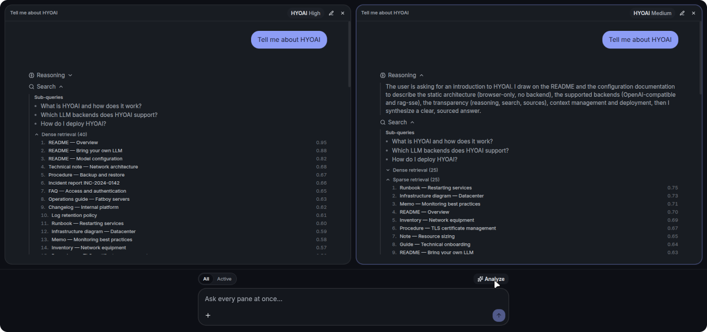
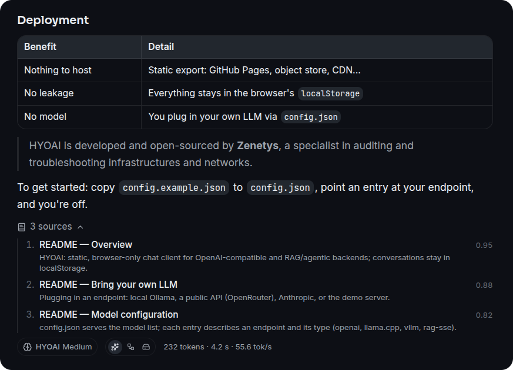
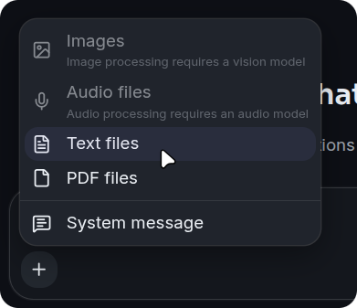
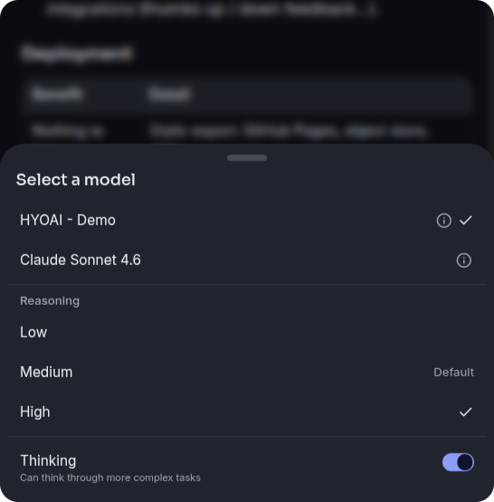

# HYOAI

> **Host Your Own AI** — a server-less, browser-only chat UI for any
> OpenAI-compatible LLM.

HYOAI is a 100% static front-end: no backend of its own, nothing to deploy or
secure. The browser talks **directly** to your inference server's API
(llama.cpp, vLLM, Ollama, or any OpenAI-compatible endpoint, including public
ones). Conversations never leave the browser — they live in `localStorage`
(compressed). Drop the build anywhere static files are served: an object store,
a CDN, or right next to your inference server.

> **HYOAI ships no model.** You bring your own LLM. The
> [Bring your own LLM](#bring-your-own-llm) section gets one running in a couple
> of minutes.

## Why we built it

HYOAI is built and open-sourced by **[Zenetys](https://www.zenetys.com)**, an IT
services company specialized in infrastructure and network **audits &
troubleshooting**, **architecture consulting** (design and migration), and
**co-managed support & maintenance**.

Evaluating, comparing and benchmarking LLMs is part of how we assess technical
choices — for ourselves and for our clients. We wanted a dependency-free way to:

- **test and benchmark** LLM endpoints quickly, from any machine, with no setup;
- **verify OpenAI-API compatibility** across backends (llama.cpp, vLLM, Ollama,
  public APIs) from a single client;
- have a **self-sufficient, portable** chat client with nothing to host, no
  database, and no data leaving the browser.

It started life as a replacement for llama.cpp's bundled web UI and grew into a
general-purpose, multi-backend client.

## Bring your own LLM

HYOAI needs an LLM endpoint to talk to. You point it at a **local** server you
run yourself, or at a **remote** API — or both, and switch between them from the
model menu, where a reasoning level and thinking toggle also live when the model
declares them (see [Reasoning](#reasoning-thinking-and-effort)).



### Local model

Run a model on your own hardware. The fastest path is **Ollama**, in two
commands:

```bash
docker run -d --name ollama -v ollama:/root/.ollama -p 11434:11434 \
    -e OLLAMA_ORIGINS='http://127.0.0.1:4117' ollama/ollama
docker exec -it ollama ollama run llama3.2:1b   # small, CPU-friendly (alt: qwen2.5:0.5b)
```

Then add this to `public/config.json` (already present in
`config.example.json`):

```json
{
    "id": "ollama",
    "name": "Ollama (local)",
    "baseUrl": "http://127.0.0.1:11434/v1",
    "type": "openai",
    "model": "llama3.2:1b",
    "streaming": true
}
```

`OLLAMA_ORIGINS` must allow the page origin (here the dev server,
`http://127.0.0.1:4117`) so the browser may call Ollama — use `*` for quick
tests only.

**llama.cpp** works the same way — run `llama-server` with a CORS origin, then
point an entry at it (no `model`, so every model the server lists becomes
selectable):

```bash
llama-server -hf ggml-org/gpt-oss-20b-GGUF \
    --host 0.0.0.0 --port 8080 --http-cors-origin http://127.0.0.1:4117
```

```json
{
    "id": "llamacpp",
    "name": "Local llama.cpp",
    "baseUrl": "http://127.0.0.1:8080",
    "type": "llama.cpp",
    "streaming": true
}
```

**vLLM** likewise — serve a model with the front-end origin allowed:

```bash
vllm serve Qwen/Qwen2.5-7B-Instruct \
    --host 0.0.0.0 --port 8000 --allowed-origins '["http://127.0.0.1:4117"]'
```

```json
{
    "id": "vllm",
    "name": "vLLM server",
    "baseUrl": "http://127.0.0.1:8000/v1",
    "type": "vllm",
    "model": "Qwen/Qwen2.5-7B-Instruct"
}
```

All three are pre-wired in `config.example.json`; the [CORS](#cors) section
lists the per-backend origin flags.

### Remote model

Point HYOAI at a hosted API instead. Browsers can only call APIs that send CORS
headers. **[OpenRouter](https://openrouter.ai)** does, so it works directly from
a static deployment:

```json
{
    "id": "openrouter",
    "name": "OpenRouter",
    "baseUrl": "https://openrouter.ai/api/v1",
    "type": "openai",
    "model": "openai/gpt-4o-mini",
    "apiKey": "sk-or-xxxxxxxx",
    "streaming": true
}
```

The **OpenAI** API does not allow direct browser calls (no CORS); reach it
through a same-origin reverse proxy (a relative `baseUrl`, see
[CORS](#cors)) or a small local proxy. Note that any `apiKey` in `config.json`
ships to the browser, so only use keys you are comfortable exposing on that
origin, or front the endpoint with a proxy that injects the key.

**Anthropic** can be reached directly from the browser by declaring its opt-in
through the per-model `headers` field:

```json
{
    "id": "claude",
    "name": "Claude (Anthropic)",
    "baseUrl": "https://api.anthropic.com/v1",
    "type": "openai",
    "model": "claude-sonnet-4-6",
    "apiKey": "sk-ant-xxxxxxxx",
    "headers": { "anthropic-dangerous-direct-browser-access": "true" }
}
```

## Quick start (the app)

```bash
npm install
cp public/config.example.json public/config.json   # then edit to taste
npm run dev                                         # http://127.0.0.1:4117
```

| Script           | Description                                    |
| ---------------- | ---------------------------------------------- |
| `npm run dev`    | Dev server on `http://127.0.0.1:4117`          |
| `npm run build`  | Production build (static export to `out/`)     |
| `npm run start`  | Serves `out/` on port 4118                     |
| `npm run check`  | `tsc --noEmit` + ESLint + Prettier (read-only) |
| `npm run format` | Prettier + ESLint in write mode                |

`npm run build` produces a fully static `out/` directory. Deploy it to any
static host; `config.json` sits at the site root and can be edited without a
rebuild.

## Model configuration: `config.json`

`config.json` is the source of truth for the model list: on startup the
application loads a `config.json` file served next to it (in dev:
`public/config.json`; in prod: dropped at the site root, editable without a
rebuild). Each entry describes a model and the endpoint serving it. The in-app
**Config** tab (Settings) edits the same fields as local overrides, stored in
`localStorage` on top of the deployed file and revertable from the Reset dialog.



`public/config.json` is gitignored (it holds deployment-specific endpoints):
copy `public/config.example.json` to `public/config.json` to get started. The
example covers the two on-ramps above plus the different `type`s, a minimal
entry (booleans have defaults), a disabled entry, an API key, and a relative URL
behind a reverse proxy.

An optional root `appName` key sets the deployment name shown on the empty chat
screen (`Chat with <appName> models`); when omitted it falls back to a generic
localized word (`AI` / `IA`).

Keys of a `models` entry:

| Key                | Type                                           | Description                                                                                                                                                                                                     |
| ------------------ | ---------------------------------------------- | --------------------------------------------------------------------------------------------------------------------------------------------------------------------------------------------------------------- |
| `id`               | string (required)                              | Stable identifier, referenced by `defaultModel` and local preferences                                                                                                                                           |
| `name`             | string                                         | Name shown in the selector (default: `id`)                                                                                                                                                                      |
| `baseUrl`          | string (required)                              | Endpoint base URL, with or without `/v1`; absolute, or relative to the site (`/llm`, `./llm`)                                                                                                                   |
| `model`            | string                                         | Pins the upstream model sent to the API; when absent, every model listed by the endpoint's `GET /v1/models` becomes selectable (llama.cpp, llama-swap)                                                          |
| `type`             | `vllm` \| `llama.cpp` \| `openai` \| `rag-sse` | Selects the transport: OpenAI-compatible (`vllm`/`llama.cpp`/`openai`) or the named-event RAG protocol (`rag-sse`, with search steps and sources); also drives the sampling-parameter mapping (default: `vllm`) |
| `apiKey`           | string                                         | Optional; sent as `Authorization: Bearer` when present                                                                                                                                                          |
| `streaming`        | boolean                                        | `true`: token-by-token SSE; `false`: single JSON response (default: `true`)                                                                                                                                     |
| `sendContext`      | boolean                                        | `true`: full branch history; `false`: last message only (default: `true`)                                                                                                                                       |
| `disabled`         | boolean                                        | `true`: keep the entry in the file but hide it from the model selector (default: `false`)                                                                                                                       |
| `modalities`       | `{ image?, audio? }`                           | Attachment capabilities; a `false` flag disables that attachment menu entry. Off by default unless the endpoint is probed (`runtimeProps`, e.g. llama.cpp `/props`); overridable                                |
| `supportsThinking` | boolean                                        | Whether the reasoning toggle is offered. Defaults from `type` and from the presence of a `thinking` config, overridable                                                                                         |
| `runtimeProps`     | boolean                                        | Whether the endpoint exposes a llama.cpp-style `GET /props` (context size, modalities, model info). Defaults from `type`, overridable                                                                           |

An optional `headers` object adds custom request headers to every call to the
endpoint (merged after the `apiKey` bearer) — use it for provider opt-ins such
as Anthropic's `anthropic-dangerous-direct-browser-access`.

Only the active choice (entry and picked model) is remembered in localStorage;
the file remains the source of truth for the list. Discovered lists refresh at
startup and whenever the model selector opens, and `runtimeProps` endpoints are
also probed through `GET /props` for their context size, modalities (image and
audio attachments are gated on them) and the model information dialog.

## Reasoning: `thinking` and `effort`

A model that exposes a reasoning knob (Qwen3, gpt-oss, ...) can declare how to
drive it from the model menu. Both keys live either at the top level (applied to
every model) or on a `models` entry (which overrides the top-level default), and
both merge a backend-specific fragment into the request body — so the same UI
adapts to any server. The controls only appear where the keys are present, and
each compare pane keeps its own choice (otherwise the global setting applies).

`thinking` is an on/off toggle. Its `on`/`off` fragments are sent when the
Reasoning switch is on or off; a missing side sends nothing, leaving the model's
own default:

```json
{
    "thinking": {
        "on": { "chat_template_kwargs": { "enable_thinking": true } },
        "off": { "chat_template_kwargs": { "enable_thinking": false } }
    }
}
```

`effort` is a level picker. `levels` is an ordered list shown as a submenu; the
active level's `body` is merged into the request and `default` is the id used
until the user picks another:

```json
{
    "effort": {
        "default": "medium",
        "levels": [
            { "id": "low", "label": "Low", "body": { "reasoning_effort": "low" } },
            { "id": "high", "label": "High", "body": { "reasoning_effort": "high" } }
        ]
    }
}
```

Typical knobs: `chat_template_kwargs` with `enable_thinking` (Qwen3),
`reasoning_effort` (gpt-oss), or `reasoning_budget` (`0` disables thinking on
some llama.cpp Qwen3 builds).

## Integrations

`config.json` may declare an optional `integrations` array to wire UI actions to
external HTTP endpoints without code changes — adding another endpoint is a pure
config edit. Each entry targets some model entries (`models`, or all when
omitted) and fires a JSON `POST`:

```json
{
    "integrations": [
        {
            "id": "feedback",
            "kind": "feedback",
            "url": "https://collector.example.com/feedback",
            "headers": { "Authorization": "Bearer xxxxxxxx" },
            "models": ["local"]
        }
    ]
}
```

| Key       | Type              | Description                                                            |
| --------- | ----------------- | ---------------------------------------------------------------------- |
| `id`      | string (required) | Stable identifier                                                      |
| `kind`    | `feedback`        | Built-in kind; `feedback` adds thumb up/down buttons under each answer |
| `url`     | string (required) | Endpoint called when the action fires                                  |
| `method`  | string            | HTTP method (default: `POST`)                                          |
| `headers` | object            | Extra request headers (e.g. an `Authorization` bearer)                 |
| `models`  | string[]          | `models` entry ids it applies to; omit for all                         |

The `feedback` kind POSTs `{ rating, integrationId, model, conversationId,
messageId, content }`. An unknown or malformed entry is dropped rather than
failing the whole config. As with `apiKey`, any token in `headers` ships to the
browser, so keep these endpoints internal or front them with a proxy.

## Embed

The same static build doubles as an embeddable widget: loaded in an iframe with
`?embed=1`, it renders a compact chat surface instead of the full application —
no second bundle, still no server side.

```html
<iframe
    src="https://chat.example.com/?embed=1&model=local&lock=1&intro=1"
    title="Assistant"
    style="width: 380px; height: 560px; border: 0"
></iframe>
```

The URL carries the look, the locale and the forced model; a `postMessage`
bridge lets the host page set the system prompt, inject a turn, follow the
generation state or run a headless completion in a hidden iframe. The widget
only accepts messages from the origins listed in `embedOrigins`.

See **[docs/embed.md](docs/embed.md)** for the parameter list, the message
contract and the storage isolation rules.

## CORS

The app is served from a different origin than the inference endpoints, so each
endpoint must allow the front-end origin:

- **llama.cpp**: `--http-cors-origin http://127.0.0.1:4117`
- **vLLM**: `--allowed-origins '["http://127.0.0.1:4117"]'`
- **Ollama**: `OLLAMA_ORIGINS=http://127.0.0.1:4117`

Without it, the browser blocks the requests and the UI reports a network error.

**Public APIs:** some send CORS headers and work directly (e.g. OpenRouter);
others (e.g. OpenAI) do not and cannot be called straight from a browser.

**CORS-free alternative:** serve the app behind a reverse proxy that also
exposes the inference endpoint, and use a relative `baseUrl` (`/llm`). Requests
then stay on the same origin and no CORS configuration is needed. A `./llm`
`baseUrl` resolves against the page directory (useful under a sub-path).

## Related projects

HYOAI's niche is the **pure-client, static** end of the spectrum: no backend, no
container required, multi-backend, with reasoning controls and a compare mode.
Other good projects, grouped by architecture:

- **Client-only / static (closest peers):**
  [Hollama](https://github.com/fmaclen/hollama),
  [BetterChatGPT](https://github.com/ztjhz/BetterChatGPT),
  [WebLLM Chat](https://github.com/mlc-ai/web-llm-chat) (runs models in-browser
  via WebGPU), [TypingMind](https://www.typingmind.com) (proprietary).
- **Server-based (richer, need a backend):**
  [Open WebUI](https://github.com/open-webui/open-webui),
  [NextChat](https://github.com/ChatGPTNextWeb/NextChat),
  [LibreChat](https://github.com/danny-avila/LibreChat),
  [Lobe Chat](https://github.com/lobehub/lobe-chat),
  [AnythingLLM](https://github.com/Mintplex-Labs/anything-llm),
  [Hugging Face chat-ui](https://github.com/huggingface/chat-ui).
- **Desktop apps:** [Jan](https://github.com/janhq/jan),
  [LM Studio](https://lmstudio.ai),
  [GPT4All](https://github.com/nomic-ai/gpt4all).

## Stack

- Next.js (App Router, static export in production), React 19, strict TypeScript
- Tailwind CSS v4, shadcn/ui (Radix primitives via the unified `radix-ui` package)
- next-themes (light/dark/system) + two switchable skins (`soft`, `flat`)
- next-intl (FR/EN, no routing)
- react-markdown + remark-gfm + rehype-highlight (Markdown and code rendering)
- lz-string (conversation compression in localStorage)

## Structure

```
app/            layout (fonts, anti-FOUC script), single page, globals.css (tokens + skins)
components/     chat/ (view, message, composer, dialogs), settings/ (tabs, fields,
                editors, dialogs), layout/ (shells, header, sidebar), compare/,
                markdown/, common/ (cross-domain), ui/ (shadcn)
hooks/          useStore (useSyncExternalStore + selectors), useActiveChat, useConversations
lib/            api/ (SSE, params mapping), storage/ (compressed localStorage, quota),
                stores/ (settings, models, conversations, chat), messageTree, chatActions
messages/       next-intl catalogs fr.json / en.json
docs/           embed.md (widget parameters, postMessage bridge)
public/         config.json (models), assets
types/          shared types (chat, server, settings, api, storage)
```

## Features

- Local conversations: lightweight index + one localStorage key per
  conversation, debounced writes while streaming, usage gauge and JSON
  export/import

    

- Branches: editing a message or regenerating a reply creates a navigable
  alternative version (1/2 indicator on each message)
- Quote & reply: quote a whole message or just a text selection to anchor the
  next question on it

    

- Reasoning (`reasoning_content`) shown in a collapsible block, per-message
  stats (tokens, tok/s, duration); a thinking toggle and effort level in the
  model menu when declared in `config.json` (see above), per pane in compare mode

    

- Compare mode: run the same prompt against two models side by side, each pane
  keeping its own reasoning choice

    

- Markdown & sources: tables, code highlighting and blockquotes render inline;
  answers can carry retrieved source citations alongside the per-message stats

    

- Images: paste/drag-and-drop, resized client-side before sending (OpenAI
  vision format)

    

- Sampling and penalty settings: an empty field is not sent (the endpoint
  applies its own defaults); parameter names are adapted to the endpoint `type`
  (`repetition_penalty` for vLLM, `repeat_penalty` and `dry_*` for llama.cpp)
- Shortcuts: Ctrl/Cmd+K (palette), Ctrl/Cmd+B (sidebar), Ctrl/Cmd+Shift+O
  (new conversation)
- Responsive, touch-first on mobile: below the `md` breakpoint the model and
  conversation menus open as bottom drawers (drag handle, swipe-to-dismiss,
  safe-area padding) and message actions as a sheet, so long menus stay
  thumb-reachable; the media-query hook is SSR-safe, so the static export
  hydrates cleanly

    

- Accessible: icon-only controls carry `aria-label`s and decorative glyphs are
  `aria-hidden`; drawers and dialogs keep a title (visually hidden when not
  shown), and menu focus returns to its trigger or is handed off on dismiss —
  keyboard-operable throughout via the underlying Radix primitives

## License

Licensed under the [Apache License 2.0](LICENSE). Copyright 2026 Zenetys — see
[NOTICE](NOTICE).
